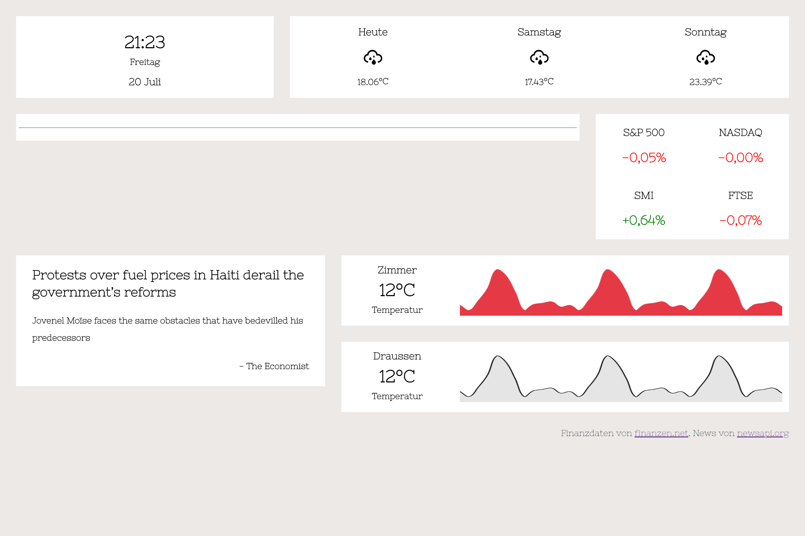

# FlashDash

FlashDash is a simple to use personal dashboard that can display a variety of information.
 

## Features

The dashboard can show the following things:

- weather for the next three days
- news from a wide range of sources
- date and time
- temperature or related time series data from a REST-API
- more coming soon..

## Installation and Usage

IMPORTANT: Since this project is still under active development things will change & break.

#### Prerequisites
- Python
- Webbrowser (preferrably Chrome/Chromium since it doesn't look as polishes in Edge or Firefox )

#### Installation
1. Fork, clone or download this repository into a directory on your computer
2. Create a file called `config.yaml` in the same folder. It should be on the same level in the filesystem as the file `webserver.py`.
3. Run `pip install -r requirements.txt` to install the dependencies which are necessary.

##### API Keys and `config.yaml`

In your newly created `config.yaml` copy and paste the following YAML code:
```yaml
weatherAPIKey: replace_me
newsAPIKey: replace_me
```
Enter your API Keys which you can obtain at [https://openweathermap.org/](https://openweathermap.org/) and [https://newsapi.org/](https://newsapi.org/).

#### Usage
1. Open `index.html` in your browser.
2. Open your terminal and type `python webserver.py`

Now, after waiting for a couple of seconds for everything to set up, your dashboard is running.


## Background of the project

This project has been written to transform an old LCD screen we had lying around our office into a modern dashboard using a RaspberryPi. Despite not containing any tests and having some rough edges, this side project will be maintained by us (and not be left to rot by itself).


## Technical info

The frontend (the `index.html`) which you are viewing in your browser has been written using standard HTML and CSS. Yahoo's Pure CSS has been used for the grid system. Once the site has finished loading, websockets are initiated for every widget on the website.
The `webserver.py` is a simple Python script which starts a webserver (using flask) and provides websockets which connect with the frontend. After initialization the python script enters a loop where it continually updates the frontend as time passes.


## License

The code which has been written by me, David Zollikofer and is licensed under the very liberal MIT license. [The license can be found in the LICENSE.md file](./LICENSE.md) with a tiny caveat. If you do use my code for a cool projects feel free to send me an email to david@zollikofer.co to let me know, it would be awesome to see my code being used elsewhere.

## Issues

If you encounter issues you can open an issue here on Github. Furthermore, your help is greatly appreciated, feel free to contribute to this open project.
